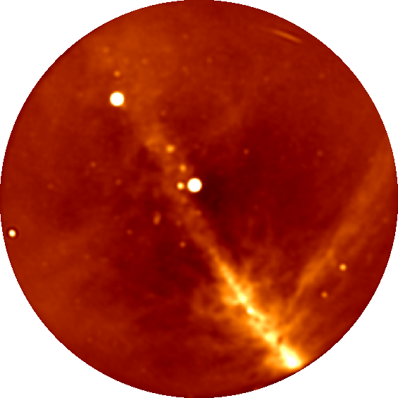

# TTCal

TTCal is a calibration routine developed for the OVRO LWA.

## Overview

The standard procedure for phase calibrating a radio interferometer
usually involves slewing a small number of large dishes to stare at
a known point source. A point source at the phase center of the
interferometer has zero phase on all baselines, so phase calibration
essentially amounts to zeroing the phase on all baselines.

Low frequency telescopes (<300 MHz) tend to occupy an entirely different
region of phase space. That is they are usually composed of numerous
cheap dipole antennas with very broad beams ([LOFAR](http://www.lofar.org/),
[MWA](http://www.mwatelescope.org/)). Furthermore, the low frequency sky
is corrupted by propagation through the ionosphere. Until the field matures,
the demand for a new and effective calibration technique
is best met by a simple, adaptable, and relatively fast software package.
This is why I wrote TTCal.

| Figure 1. An OVRO LWA snapshot image made using data calibrated exclusively with TTCal. |
|-----------------------------------------------------------------------------------------|
|                       |

## Getting Started

TTCal requires version 0.4 of the [Julia](http://julialang.org/) programming
language. Julia is a dynamic language designed for scientific computing with
a just-in-time compiler based on [LLVM](http://llvm.org/). The syntax
should be familiar to users of [Matlab](http://www.mathworks.com/products/matlab/)
and [Python](https://www.python.org/), but Python users should be aware
that the first element of an array is accessed with `x[1]`.

Once Julia is installed, the REPL (read-eval-print loop) can be started by
typing `julia` from the command line. Try running the following examples:
``` julia
julia> 1+1
2

julia> for i = 1:3
           println(rand())
       end
0.8165122957881887
0.8315752097289137
0.6558156424738537
```

TTCal depends on the [CasaCore.jl](https://github.com/mweastwood/CasaCore.jl)
package, which is a Julia wrapper of the [casacore](http://casacore.github.io/casacore/)
library. It is used to interface with measurement sets and perform
coordinate conversions.

To install TTCal run:
``` julia
julia> Pkg.update()

# Get the latest version of CasaCore.jl and build the wrapper
julia> Pkg.clone("CasaCore")
julia> Pkg.build("CasaCore")

# Get the latest version of TTCal
julia> Pkg.clone("https://github.com/mweastwood/TTCal.jl.git")
julia> Pkg.test("TTCal")
```
If all the tests pass, you are ready to begin using TTCal.

While the most powerful interface to TTCal involves writing small
Julia scripts, a limited command line interface is available.
Simply add the `ttcal.jl` file to your `PATH` environment variable.
You can see the list of available commands by running:
```
$ ttcal.jl --help
usage: ttcal.jl [-h] {gaincal|polcal|peel|applycal}

A calibration routine developed for the OVRO LWA.

commands:
  gaincal     Solve for a gain calibration.
  polcal      Solve for a polarization calibration.
  peel        Peel sources from the dataset.
  applycal    Apply a calibration.

optional arguments:
  -h, --help  show this help message and exit
```

Note that every time Julia is restarted there is overhead
associated with reloading and recompiling the code. While
Julia version 0.4 introduced code caching to help mitigate this,
running TTCal will always be faster from a Julia script
than from the command line.

!!! note
    TTCal expects data to be provided as a measurement set. Furthermore each
    measurement set must contain only a single spectral window and a single time integration.

## Bugs, Errors, and Questions (oh my!)

If you encounter any problems or errors, please
[open an issue](https://github.com/mweastwood/TTCal.jl/issues/new)
on Github. Known problems are listed as
[open issues](https://github.com/mweastwood/TTCal.jl/issues).

If you have any questions after reading through this documentation
let Michael know by
[opening an issue](https://github.com/mweastwood/TTCal.jl/issues/new)
on Github.

